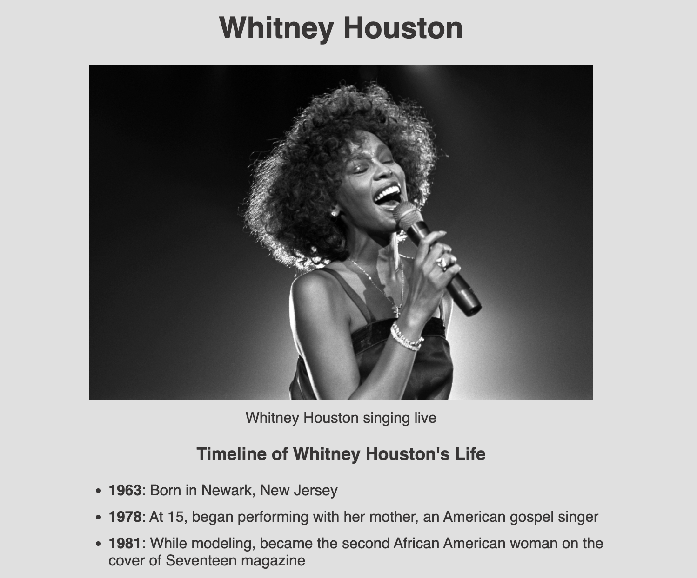

# fcc-tribute-page

Live Site: [Whitney Houston Tribute Page](https://kaykaym01.github.io/fcc-tribute-page/)

Challenge Description: [FreeCodeCamp: Responsive Web Design Tribute Page](https://www.freecodecamp.org/learn/responsive-web-design/responsive-web-design-projects/build-a-tribute-page)

This project is a part of FreeCodeCamp's Responsive Web Design course. The challenge is to create a tribute page similar to this: https://codepen.io/freeCodeCamp/full/zNqgVx

Required Elements:
* Tribute Image
* Timeline of Tribute Subject's Life
* Link to Additional Information

Skills Demonstrated:
* HTML
* CSS
